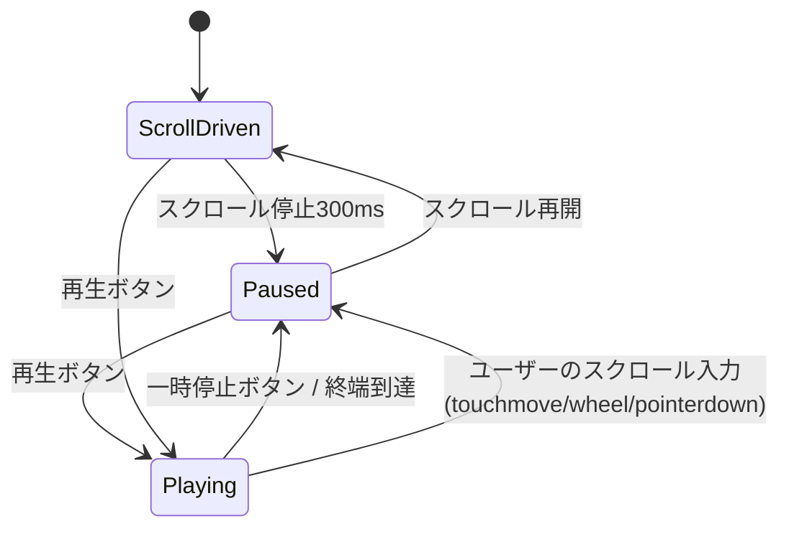

# アニメーション仕様書（docs/animation-spec.md）v0.1 ドラフト

> 技アニメ（SVG骨格）・視点切替・再生/スクロール同期・一時停止→部位マーカー・ポーズエディタの規約。
> ディレクター確認済み事項を反映。お任せ分は「■提案」。実物を見て変更する前提。

---

## 0. 決定事項サマリ

| 項目 | 決定 |
|---|---|
| 表現レベル | **A 棒人間（墨の筆線）で技術検証 → B 簡略シルエットへ昇格**。データ形式はA/B共通 |
| 視点 | **2D真横固定**（巻物と整合）。背中越しカメラは除外 |
| 視点切替の定義 | **画面左右反転＋注目側＝手前レイヤー・濃墨、相手＝奥レイヤー・淡墨。注目側のみ6部位マーカー＋帯矢印** |
| 関節 | 15点＋頭の向き＋視線＋帯（丹田）向き ■提案 |
| 再生 | **巻物スクロール連動が基本。再生ボタンで自動スクロール同期。再生中にスクロール入力→停止** |
| ポーズ制作 | **c：Claude Codeが推定→ディレクターが実際に動いて修正**。修正は**簡易ポーズエディタ**で行う |
| 座標系・補間 | ■提案（§2, §5） |

---

## 1. 人体モデル（■提案）

### 1-1. 関節15点
```
head        頭（頭頂ではなく頭の中心）
neck        首（鎖骨の間）
shoulder_f / shoulder_b   肩（手前/奥）
elbow_f    / elbow_b      肘
wrist_f    / wrist_b      手首
hip         腰（帯の結び目＝丹田の位置）
hipjoint_f / hipjoint_b   股関節
knee_f     / knee_b       膝
ankle_f    / ankle_b      足首
```
- 左右ではなく **f（手前）/ b（奥）** で命名する。2D真横では「手前脚＝前足」とは限らないため、左右反転・半身反転に耐えるための命名。
- 足先はA段階では足首から前方へ固定長の短線を描く（`facing` に従う）。B段階で `toe_f/b` を追加可。

### 1-2. 向きパラメータ（関節に加えて持つ）
| キー | 型 | 意味 | 表示 |
|---|---|---|---|
| `facing` | `1 \| -1` | 体の正面が右(+1)か左(-1)か | 全体の描画方向 |
| `head_dir` | 角度（度） | 顔の向き（0=facing方向、+上、−下） | 頭から短い筆線 |
| `gaze` | 角度（度） | 視線 | 目の点＋細い点線（部位「目」のマーカー起点） |
| `hara_dir` | 角度（度） | 帯の結び目（丹田）の向き | **朱の短い矢印**（`--shu`） |

- 「肩」はshoulder_f/b、「顔」はhead＋head_dir、「腹（帯）」はhip＋hara_dir、「膝」はknee_f/b、「足」はankle_f/b、「目」はhead＋gaze に対応（§6）。

### 1-3. 描画スタイル
- **A（棒人間）**：関節を結ぶ `<path>`。`stroke-linecap: round`、太さは胴 8 / 四肢 6 / 首 4（単位=viewBox）。注目側 `--sumi-shou`、相手側 `--sumi-tan`。関節に小さな墨点。
- **B（簡略シルエット）**：同じ関節座標から、胴・袴・袖を太い筆面 `<path>` に展開（関節データは不変）。
- 筆致：`stroke-dasharray` で技開始時に「描かれる」演出（`prefers-reduced-motion` で無効）。

---

## 2. 座標系（■提案）

- `viewBox="0 0 1000 600"`。**SVG標準（原点左上、yは下向き）**をそのまま使う。変換の手間と事故を防ぐため。
- 地面 `y=520`。身長 **400単位**（headのy≈120〜140）。
- 取りは初期状態で `facing: +1`（右向き）、画面中央 `x≈400`。受けは `facing: -1`、`x≈600`。
- **ポーズは常に「取り右向き」で作る**。左向きは実行時に `transform="scale(-1,1) translate(-1000,0)"` で反転（§4）。
- 単位は整数。エディタでも整数スナップ。

---

## 3. ポーズデータ形式

ファイル：`content/poses/{技id}.pose.json`（技mdと同じid）

```jsonc
{
  "id": "ikkyo-omote",
  "viewBox": [1000, 600],
  "ground": 520,
  "source": "estimate",                      // 動きの出どころ：estimate（記述からの推定・省略時も推定）／edited（ポーズエディタで直した）／mocap（動画から）。estimate の間は画面に「推定の動き」の注記（decisions D-45）
  "keyframes": [
    {
      "id": "kamae", "at": 0.0,                // content-spec の [kf] id / at と一致必須
      "ease": "power2.inOut",                   // 次kfへの補間（省略時 power2.inOut）
      "tori": {
        "facing": 1, "head_dir": 0, "gaze": -5, "hara_dir": 0,
        "joints": {
          "head": [400,130], "neck": [400,175],
          "shoulder_f": [418,185], "shoulder_b": [382,185],
          "elbow_f": [440,235], "elbow_b": [370,240],
          "wrist_f": [470,270], "wrist_b": [372,290],
          "hip": [400,300],
          "hipjoint_f": [412,305], "hipjoint_b": [388,305],
          "knee_f": [445,410], "knee_b": [360,410],
          "ankle_f": [470,520], "ankle_b": [330,520]
        }
      },
      "uke": { "facing": -1, "head_dir": 0, "gaze": 0, "hara_dir": 0, "joints": { /* 同 */ } }
    },
    { "id": "contact", "at": 0.15, "tori": {}, "uke": {} }
  ]
}
```

**制約**
- `keyframes[].id` と `at` は **content-spec の `[kf]` と完全一致**（片方にしか無いkf → エラー）。
- `at` 単調増加。同一 `at` 禁止。
- 15関節すべて必須。欠落 → エラー。
- 骨長チェック：隣接関節間の距離がkf間で **±15%** を超えて変化 → 警告（伸び縮みした絵を防ぐ）。
- `ease` は GSAP の名前だけ（例 `power2.inOut`、`back.out(1.7)`）。それ以外 → エラー（decisions D-44）。
- `source` は `estimate` / `edited` / `mocap` だけ。ポーズエディタで関節を動かして保存すると `edited` になる。

---

## 4. 視点切替（ディレクター定義）

| 状態 | 取り | 受け |
|---|---|---|
| `view: tori`（既定） | 手前レイヤー・濃墨・マーカー表示・帯矢印表示 | 奥レイヤー・淡墨・マーカー非表示 |
| `view: uke` | 奥レイヤー・淡墨 | 手前レイヤー・濃墨・マーカー・帯矢印 |

- `view: uke` では**シーン全体を左右反転**（`scale(-1,1)`）し、注目側が「自分の体と同じ向き」に見えるようにする。
- 反転時、文字・吹き出しは反転しない（マーカーはSVG外のHTMLレイヤーに描く）。
- 切替はタブ（取り／受け）。切替時は現在の `at` を維持。

---

## 5. 補間と再生（■提案）

### 5-1. 補間
- GSAP Timeline。kf間を `ease`（既定 `power2.inOut`）で全関節を同時補間。
- **関節別イージングはv1では不採用**（複雑化を避ける）。速い局面は中間kfを追加して表現する運用。
- 向きパラメータ（角度）も同じイージングで補間。`facing` は補間せず、変わるkfで瞬時に切替（反転する技は中間kfで「正面向き相当」を挟まない。2Dなので割り切る）。

### 5-2. 再生位置と巻物の同期
- 技セクションの横スクロール量を 0.0〜1.0 に正規化 → `timeline.progress(p)`。
- 状態機械：


- `Playing` 中は GSAP が巻物を **自動スクロール**（`scrollTo` を progress に同期）。ユーザー入力を検知したら即 `Paused` に落とし、以後はスクロール駆動に戻る。
- 速度：1x / 0.5x のトグル。`prefers-reduced-motion` 時は自動スクロールを無効化し、ボタンで kf 単位のステップ送りに切替。

### 5-3. 一時停止の定義
- `Paused` に入った瞬間に**6部位マーカー**（§6）を表示。`ScrollDriven` / `Playing` 中は非表示。
- 一時停止時の `progress` に最も近い kf（`|progress - at|` 最小）を「現在kf」とし、その kf の解説（content-spec）を出す。

---

## 6. 6部位マーカーと解説の紐付け

| 部位 | 起点となる関節/パラメータ | マーカー位置 |
|---|---|---|
| 目 `eye` | `head` ＋ `gaze` | 頭から視線方向へ 30 単位 |
| 顔 `face` | `head` ＋ `head_dir` | 頭の輪郭外側 |
| 肩 `shoulder` | `shoulder_f`（注目側の手前肩） | 肩点の上 |
| 腹（帯）`hara` | `hip` ＋ `hara_dir`（朱矢印） | 矢印先端 |
| 膝 `knee` | `knee_f` | 膝点の外側 |
| 足 `foot` | `ankle_f` | 足首点の下 |

- 各関節は SVG 要素に **`id="{role}-{part}[-{f|b}]"`**（技術書の命名規則）を付与し、`getBoundingClientRect()` でHTMLレイヤーの吹き出し座標を得る。
- マーカーは l1 テキスト（20字）を筆線の引き出し線付きで表示。タップ／ピンチアウトで l2〜l5 へ（技術書のトグル・history仕様）。
- ズームイン時は `transform-origin` を該当関節座標に合わせ、`scale(2.0)` まで。

---

## 7. ファイル配置と生成

```
content/poses/ikkyo-omote.pose.json      # 関節データ（エディタで編集）
src/lib/anim/Body.svelte                 # 関節→SVG描画（A/B切替）
src/lib/anim/timeline.ts                 # pose.json → GSAP Timeline
src/lib/anim/markers.ts                  # 一時停止→座標→吹き出し
tools/pose-editor.html                   # 単体HTMLのポーズエディタ（§8）
```
- pose.json は**手書きしない**。初版は Claude Code が技記述から推定生成（§9）、以後はエディタで編集。

---

## 8. 簡易ポーズエディタ仕様（初学者向け）

**方針**：ビルド不要の**単一HTMLファイル**（`tools/pose-editor.html`）。ブラウザで開くだけで動く。依存ライブラリなし（Vanilla JS）。

### 8-1. 画面
```
┌──────────────────────────────────────────┐
│ [ファイルを開く] [保存(JSONダウンロード)] [コピー] │
│ 技: ikkyo-omote   kf: [kamae ▼] [＋kf追加] [削除]  │
│ at: [0.15]  ease: [power2.inOut ▼]                │
├──────────────────────────────────────────┤
│                                          │
│   （SVGキャンバス 1000×600 / 地面線）         │
│    ○─○ 取り(濃)      ○─○ 受け(淡)            │
│   前kfの残像(薄い灰)                         │
│                                          │
├──────────────────────────────────────────┤
│ 選択中: tori.knee_f  x:[445] y:[410]            │
│ head_dir:[0] gaze:[-5] hara_dir:[0]  facing:[→][←] │
│ [骨長ロック ☑] [残像 ☑] [プレビュー再生 ▶]         │
└──────────────────────────────────────────┘
```

### 8-2. 機能（v1）
1. **開く／保存**：pose.json を読み込み、編集後にダウンロード（ファイル名は同名）。クリップボードコピーも可。
2. **関節ドラッグ**：関節の丸をドラッグして移動。ドラッグ中は座標を表示。矢印キーで 1 単位、Shift＋矢印で 10 単位移動。
3. **骨長ロック**（既定ON）：ドラッグした関節につながる骨の長さを保ち、**先の関節を回転で追従**させる（例：膝を動かすと足首が付いてくる）。OFFで自由移動。
4. **残像（オニオンスキン）**：前後のkfを薄い灰で重ね、動きの連続を確認。
5. **向きハンドル**：頭・帯に短いハンドルを出し、ドラッグで `head_dir` / `gaze` / `hara_dir` を変更。
6. **kf操作**：追加（現在kfを複製して `at` を+0.1）、削除、`at` 編集、並び替えは `at` で自動。
7. **プレビュー再生**：kf間を線形補間で再生（GSAPなし。正確な補間はアプリ側で確認）。
8. **検証表示**：15関節の欠落、`at` 重複、骨長±15%超を赤字で警告。

### 8-3. 使い方（初学者向け・5ステップ）
1. `tools/pose-editor.html` をダブルクリックで開く（サーバー不要）。
2. 「ファイルを開く」で `content/poses/ikkyo-omote.pose.json` を選ぶ。
3. 上の「kf」で直したいキーフレームを選び、**自分でその形を取ってから**、違う関節の丸をドラッグして合わせる。膝を動かすと足首が付いてくる（骨長ロック）。
4. 「残像」をONにして前後のkfと見比べ、不自然なら「＋kf追加」で中間ポーズを足す。
5. 「保存」でJSONをダウンロードし、元の場所に上書き → Claude Code に「pose.json 更新した、反映して」と伝える。

### 8-4. v2候補（実物を見て判断）
- 写真/動画フレームを背景に薄く敷いてトレース（cの精度向上）
- 左右ミラーの一括反転、kfの一括時間シフト
- 部位マーカーのプレビュー

---

## 9. 制作ワークフロー（c方式）

| 手順 | 担当 | 成果物 |
|---|---|---|
| 1 | Fable | 技mdの kf 定義（id/at/状況説明）を確定 |
| 2 | Opus | 各kfの関節座標を**技の記述から推定**して pose.json 初版生成（骨長は共通テンプレ `content/poses/_body.json` から） |
| 3 | ディレクター | エディタで実際に動きながら修正・保存 |
| 4 | Opus | 反映・骨長チェック・アプリ上でプレビュー |
| 5 | ディレクター | 一時停止→マーカー位置が部位に乗っているか確認 |
| 6 | 師範/上級生 | 動きの妥当性を校閲（content-spec の status と連動） |

- `_body.json`：標準体型の骨長（首40、上腕60、前腕55、胴125、大腿115、下腿110 など）。全技で共有し、kf生成時の初期値と骨長チェックの基準にする。

---

## 10. バリデーション一覧

| レベル | 条件 |
|---|---|
| エラー | pose.json と md の kf id/at 不一致／15関節欠落／`at` 非単調・重複／viewBox不一致 |
| 警告 | 骨長±15%超／関節が地面 `y=520` より下／取り受けが重なりすぎ（head間距離<60）／`hara_dir` と `facing` が90°以上乖離 |

---

## 11. A→B昇格の条件

- 5級範囲6技で「一時停止→マーカー→ズーム→戻る」が iOS 実機で破綻しない。
- ディレクターがエディタで**1技分の修正を自力で完了**できる（cの成立確認）。
- 上記を満たしたら、`Body.svelte` に B レンダラー（道着・袴の筆面）を追加。**pose.json は変更不要**。

---

## 12. ■提案まとめ（お任せ分）
- 関節命名は f/b（手前/奥）。左右反転・半身反転に強い。
- 座標はSVG標準（左上原点）。viewBox 1000×600、身長400、地面y=520。
- 補間はkf間一律イージング、関節別は不採用。速い局面は中間kfで表現。
- 帯矢印は朱、視線は点線、顔向きは短い筆線。扇形は使わず、実物を見て変更。
- 骨長は `_body.json` で全技共通。

---

## 13. 3D の技アニメ（Three.js）— 2026-09-23 ディレクター決定「3D の作り方：A Three.js」

> 2D（§1〜§12）は、3D が描けない端末（WebGL が使えない）での表示として残す。3D のポーズがある技は 3D で表示する。
> Unity は採らない（今の吹き出し・ピンチ・戻る・オフライン・GitHub Pages をそのまま使い、読み込みを軽く保つため。decisions D-36）。

### 13-1. 人体モデル
- 単位メートル、y が上、床 y=0。身長約 1.75m の標準体型を `content/poses3d/_body3d.json` に置く（骨長と、描画用の太さ）。
- 関節 21 点：`head nose neck shoulder_l/r elbow_l/r wrist_l/r hand_l/r hip hara hipjoint_l/r knee_l/r ankle_l/r toe_l/r`。
  - 2D の 15 点に、顔の向き（nose）・帯の結び目の向き（hara）・手の先（hand）・つま先（toe）を関節として足した（向きも位置で持つと、補間と検証が一様になる）。
  - 左右は解剖学の l/r。画面上の手前 f／奥 b は、表示のたびにカメラに近い側を f とする（§13-4）。
- 視線は `gaze`（長さ 1 の向き）で持つ。

### 13-2. データ形式
ファイル：`content/poses3d/{技id}.pose3d.json`（技 md と同じ id）。生成物は `src/generated/poses3d/{id}.json`（標準体型を同梱）。

```jsonc
{
  "id": "ikkyo-omote",
  "source": "estimate",              // estimate＝記述からの推定、mocap＝動画から作った動き
  "note": "…",
  "keyframes": [
    { "id": "kamae", "at": 0, "tori": { "joints": { "head": [x, y, z], … }, "gaze": [x, y, z] }, "uke": { … } },
    { "id": "furikaburi", "at": 0.07, "between": true, … },   // 原稿に無い「間の kf」（動きをなめらかにするため）
    { "id": "contact", "at": 0.15,
      "contacts": [ { "hand": "tori.hand_r", "on": "uke.wrist_r" },
                    { "hand": "tori.hand_l", "on": ["uke.shoulder_r", "uke.elbow_r", 0.85] } ], … }
  ]
}
```
- `between` でない kf は、原稿の kf と id・at が一致すること（不一致はエラー）。最初と最後は原稿の kf。
- `contacts`：その kf と次の kf の両方にある組は、区間の間ずっと手を相手の部位に付けたままにする（握った手が離れない）。

### 13-3. 補間（`src/lib/anim3d/pose3d.ts`）
- 全体の長さ 1、kf の at を時刻（2D と同じ）。区間のイージングは既定 `power2.inOut`（kf の `ease` で変更可）。
- 骨の向きを球面補間し、腰（丹田）から標準の骨長でつなぐ → kf の間でも手足が伸び縮みしない。
- 脚は足首の位置を補間して膝を解く（2本の骨の IK）→ 両方の kf で同じ場所にある足は滑らない。動く足は移動距離に応じて最大 10cm 浮かせる。
- 膝・肘は床に潜らない（骨の長さを保ったまま曲がる向きを回す）。
- contacts は、kf での「手 − つかんだ点」のずれを補間して保ち、肩は動かさず肘・手首を解き直す。

### 13-4. カメラ（`src/lib/anim3d/camera.ts`）
| カメラ | 見え方 | 用途 |
|---|---|---|
| 斜め（既定） | 取りの斜め後ろ・上（30°）から | 全体の立体の関係 |
| 横 | ほぼ真横（2D と同じ。取りが左） | 2D と見比べる、高さの変化 |
| 真上 | 真上から（取りが左） | 足運び・体の向きの変化 |
- 受けの視点では、カメラを y 軸まわりに 180° 回す（受けが手前・左）。注目側は濃墨・朱の帯矢印、相手は淡墨（2D と同じ）。
- 技の全 kf の関節が画面に入る位置に固定する（技の間はカメラを動かさない）。
- 部位を開いたときの拡大は、その部位の画面上の位置を中心に写す範囲を狭める（2D の拡大と同じ見え方。にじまない）。拡大率は 2D と同じ 1＋0.2×深さ（上限 2.0）。
- 部位の起点は DOM の小さな印 `#{role}-{part}[-{f|b}] .anchor` として重ね、吹き出しの引き出し線・ピンチの部位判定は 2D と同じ仕組みで読む（CLAUDE.md 絶対ルール2 の命名）。

### 13-5. 描画（`src/lib/anim3d/renderer.ts`）
- デッサン人形：胴・手足をカプセル、頭・胸・腰を球、足を平たい箱（つま先の向きが見える）。輪郭線で墨絵に寄せる。
- 床は畳（1畳 1.82m×0.91m、列ごとに半畳ずらす）。胴の下に淡い影。
- three.js（約 135KB gzip）は技詳細で、説明文と吹き出しを出して手が空いてから読み込む。描画用プログラムは材料ごとに分けて準備し（1回の長い処理にしない）、描くのは1コマに1回。
- WebGL が使えない・失われたときは 2D に切り替える。

### 13-6. ポーズの作り方
1. **推定（今）**：`tools/pose3d-seed/*.mjs` で、腰の位置・体の向き・傾き・足首・手の位置から関節を解いて書き出す（`node tools/pose3d-seed/ikkyo-omote.mjs --force`）。記述からの推定なので、師範の校閲まで仮。
2. **動画から（撮影できたら）**：部員が技を正面と横から撮影 → 動画から 3D の骨格を作るサービス（例：DeepMotion。複数人・GLB/BVH 出力）→ 21 関節へ変換して `source: "mocap"` で置き換える。変換の道具は撮影の後に作る。
3. 2D のポーズエディタ（§8）は 3D には使えない。3D の手直しは、動画からの動きに置き換えるまでは seed の数値で行う。

### 13-7. 検証（`scripts/content/pose3d.mjs`）
| レベル | 条件 |
|---|---|
| エラー | 原稿との kf id/at 不一致／21関節の欠落・数でない／at が 0〜1 外・順でない／contacts の形が不正／_body3d.json が無い |
| 警告 | 骨長が標準から ±5% 超／関節が床より下（y < −0.02）／取りと受けの頭が 0.25m 未満／gaze が長さ 1 でない |
