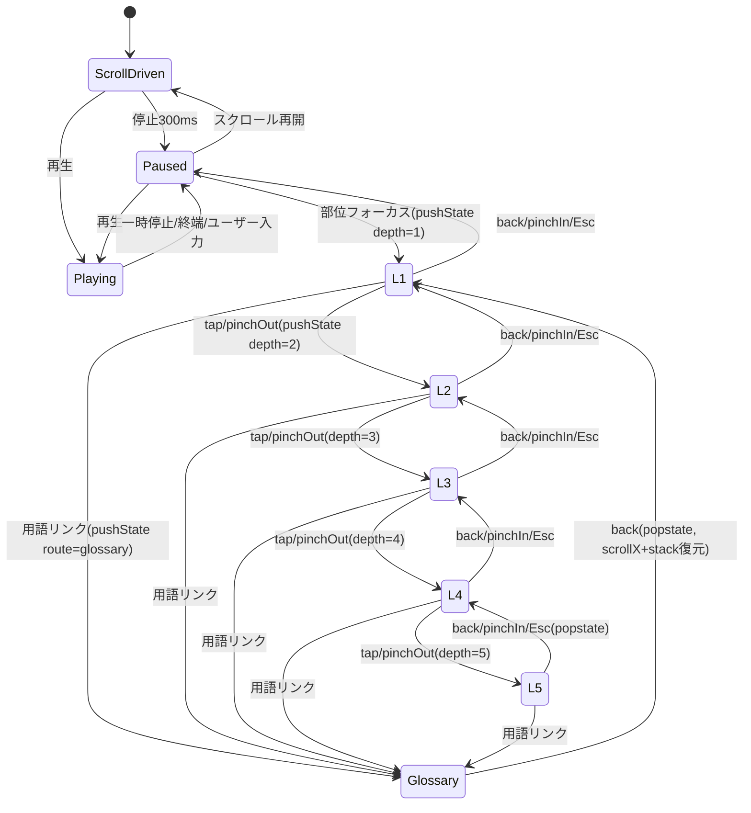

# 設計書 完成版 ― 合氣道徹底解説アプリ

版: 1.0（2026-09-13）　構成：**A部 基本設計**（技術）＋**B部 デザインシステム**（見た目と工程）
上位文書：`content-spec.md`（原稿構造）／`animation-spec.md`（アニメ）／`backlog.md`（タスク）。食い違いは上位が正。
旧 `design.md`（v0.1）と `design-system.md`（v0.2）を統合し、旧版の矛盾（3階層・l/r・固定キーフレーム）を解消した。

---

# A部 基本設計

## A-1. ディレクトリ構成
```
aikido-scroll-app/
├─ CLAUDE.md
├─ .claude/skills/aikido-scroll-app/{SKILL.md, references/}
├─ docs/{content-draft, content-spec, animation-spec, backlog, design-complete, requirements, research, roadmap, stitch-prompts, higgsfield-guide, KICKOFF-PROMPT}.md
├─ content/
│  ├─ techniques/{waza}-{omote|ura}.md   # 技×表裏で1ファイル（content-spec §1）
│  ├─ kihon/*.md                          # 基礎動作（構造は技と同じ）
│  ├─ glossary/<slug>.md                  # 用語ごと1ファイル
│  ├─ poses/{id}.pose.json, _body.json    # 関節データ（animation-spec §3）
│  └─ pages/{history,philosophy}.md
├─ scripts/build-content.mjs              # md → src/generated/*.json（バリデーション込み）
├─ tools/pose-editor.html                 # 単一HTMLのポーズエディタ（animation-spec §8）
├─ src/
│  ├─ main.ts / App.svelte / router.ts    # hash ルート + history 状態
│  ├─ lib/
│  │  ├─ anim/{Body.svelte, timeline.ts, markers.ts}
│  │  ├─ gesture/pinch.ts
│  │  ├─ history/toggleStack.ts
│  │  └─ content/loader.ts               # import.meta.glob で generated を読む
│  ├─ components/
│  │  ├─ ScrollStage.svelte              # 巻物（Scroll Snap）
│  │  ├─ ChapterCard.svelte
│  │  ├─ TechniqueView.svelte            # 視点切替＋アニメ＋再生/スクロール同期
│  │  ├─ PartBubble.svelte               # 一時停止時の l1 吹き出し
│  │  ├─ PartToggle.svelte               # l1→l5 深層トグル（ARIA）
│  │  ├─ Zoomable.svelte
│  │  ├─ GlossaryList.svelte / TermView.svelte
│  │  └─ BrushLine.svelte                # 筆線アニメ
│  ├─ styles/{tokens.css, base.css, washi.css}
│  └─ generated/                         # build:content の出力（git管理外）
├─ public/{manifest.webmanifest, icons/, fonts/}
├─ vite.config.ts                        # VitePWA, base:'/aikido-scroll-app/'
├─ .github/workflows/deploy.yml
└─ tests/{unit/, e2e/}
```

## A-2. コンテンツパイプライン
```
content/**/*.md
  → gray-matter（frontmatter）
  → remark + remark-wiki-link（[[用語]] / [[表示|正規名]] → <a data-term="slug" href="#/glossary/slug">）
  → 信頼マーク変換（{{f:}}→<span class="t-f">, {{v:}}→.t-v, 無印→.t-g）
  → 見出し規約パース（### [kf] id|名|at → #### 取り/受け → **部位**×6 → - l1〜l5）
  → 攻撃法 override（### [attack] … overrides:[…]）を attack_overrides に格納
  → content/poses/{id}.pose.json と kf id/at を突合
  → src/generated/{techniques,kihon,glossary,pages}/*.json
  → バリデーション（content-spec §6、animation-spec §10）。エラーでCI失敗、警告はログ
```
- 用語 permalink 表は `glossary/*.md` の `name_ja`＋`aliases` から生成し wiki-link 変換に渡す。同一解説文内の同一用語は初出のみリンク。
- 依存: gray-matter, unified, remark-parse, remark-rehype, rehype-stringify, @portaljs/remark-wiki-link。Node 22。

## A-3. 部位ID命名規則
```
#{role}-{part}[-{f|b}]   role=uke|tori   part=eye|face|shoulder|hara|knee|foot   f=手前 / b=奥
```
- `Body.svelte` は `<g id="tori">` 配下に `<g id="tori-eye">`… を持つ。左右のある部位（shoulder/knee/foot）は **f/b**（左右ではない。animation-spec §1-1）。
- マーカー起点は注目側の手前部位（`-f`）。詳細は animation-spec §6。

## A-4. 技アニメーションと一時停止
1. `timeline.ts` が `content/poses/{id}.pose.json`（15関節＋facing/head_dir/gaze/hara_dir）から GSAP Timeline を生成。kf 間は `ease`（既定 power2.inOut）で全関節同時補間。
2. TechniqueView は巻物内の技セクションのスクロール量を 0〜1 に正規化し `timeline.progress(p)`。再生ボタンで自動スクロール同期（animation-spec §5-2）。
3. 停止検知：スクロール停止300ms／一時停止ボタン／ユーザーのスクロール入力（再生中）。
4. 停止時、`|progress − at|` 最小の kf を「現在kf」とし、注目 role の6部位 id を走査 → `getBoundingClientRect()` → PartBubble（l1）を配置。
5. PartBubble タップ or ピンチアウト → PartToggle を l1→l2→…→l5、Zoomable が部位座標へズーム（最大2.0）。

**キーフレームは技ごとに可変**（content-spec §2-3）。共通語彙 `kamae/contact/kuzushi/irimi/tenkan/nage/osae/zanshin` を基本に技固有名を追加。`at` は 0〜1 の進捗率で md と pose.json で一致必須。旧版の「固定5段階 t=0/0.35/0.6/0.85/1.0」は廃止。

## A-5. 視点切替
- `view: tori`（既定）／`view: uke`。切替＝シーン全体を左右反転（`scale(-1,1)`）＋注目側を手前レイヤー・濃墨、相手を奥・淡墨。マーカー・帯矢印は注目側のみ。吹き出しはHTMLレイヤーなので反転しない。切替時 `progress` を保持。

## A-6. ズームジェスチャー × history 状態機械

- 実装 `src/lib/history/toggleStack.ts`。開くたび `pushState({depth,part,kf})`、手動クローズは `history.back()` と同期（二重push防止フラグ）。
- ピンチは `src/lib/gesture/pinch.ts`（Pointer Events 2指距離差分）。`touch-action:none` は**アニメ領域内の要素のみ**。ページ標準ズームは殺さない。1回のピンチで1段だけ動く（閾値・連続発火防止）。

## A-7. 巻物UI仕様
- コンテナ: `display:flex; overflow-x:auto; scroll-snap-type:x mandatory; overscroll-behavior-x:contain;`
- 各章: `scroll-snap-align:start; min-width:100vw;`
- 進捗の筆線: `@supports (animation-timeline: scroll())` で CSS、非対応は GSAP ScrollTrigger。
- 技詳細は巻物内セクション。縦に長い解説は章内で縦スクロール可、外側は横のみ。
- 縦書き技名: `writing-mode: vertical-rl; font-family:'Yuji Syuku'` を章右端に固定。
- 巻物の背景絵・和紙テクスチャは**アセット**（SVG自作）、レイアウト・筆致線・骨格・トグルは**コード**（B-2-3）。

## A-8. コンポーネント責務
| コンポーネント | 責務 |
|---|---|
| ScrollStage | 巻物・スナップ・章の可視判定 |
| TechniqueView | 視点切替、Timeline生成、scrub/再生同期、停止検知、PartBubble配置 |
| Body（lib/anim） | pose.json→部位id付きSVG描画（A棒人間／B簡略シルエット切替） |
| PartBubble | l1吹き出し・タップでPartToggleを開く |
| PartToggle | l1〜l5の深層表示（現在kfの解説）、ARIA、Esc |
| Zoomable | transform-origin/scale 制御、reduced-motion対応 |
| GlossaryList / TermView | 単語集、`used_in` から技へ逆リンク、動画リンク表示 |
| router | `#/`, `#/techniques/:id`, `#/kihon/:id`, `#/glossary/:slug`, `#/pages/:name` |

## A-9. PWA
- vite-plugin-pwa: `registerType:'autoUpdate'`, `workbox.globPatterns:['**/*.{js,css,html,svg,json,woff2}']`。
- manifest: `display:'standalone'`, `orientation:'portrait'`, テーマ色 `--washi`/`--sumi-shou`。
- iOS: `apple-touch-icon`, `apple-mobile-web-app-capable`。A2HS は手動（初回に案内）。YouTube動画は埋め込まずリンクのみ。

## A-10. デプロイ
- `.github/workflows/deploy.yml`: push(main) → `npm ci` → `build:content` → `build` → `actions/deploy-pages`。
- `vite.config.ts` の `base` は `'/aikido-scroll-app/'`。カスタムドメイン時は `'/'`。

## A-11. テスト
- Vitest: loader（見出しパース・override・文字数）、pinch（距離差分→onOut/onIn）、toggleStack（push/pop整合・depth5）、pose突合。
- Playwright（iPhone/Pixel エミュレーション）: 一時停止→吹き出し→タップ展開(l1→l5)→戻る×5→ピンチ→単語集往復。
- axe-core: 各画面で違反 0。Lighthouse PWA/Perf/A11y 90+。

---

# B部 デザインシステム

## B-0. 参照動画の理念（文字起こしから確定）

- 出典：「なんか違う」デザインを爆誕させない方法。最小限の出戻りでイケてるデザインを生成しよう。（https://youtu.be/xIjU1go85Hc、38分、対談）
- 話者：Base44 のケイ氏（フロントエンドエンジニア／デベロッパーアドボケイト。PoCを日常的に量産する立場）＋聞き手1名。【動画】
- 対象読者：「Figmaでゴリゴリ描くデザイナー」ではなく、**コードとプロダクトの勘はあるがデザインを考えるのが大変な人**。【動画】＝本プロジェクトのディレクターと同じ立場。

### B-0-1. 主張の骨子【動画】
1. **いきなりデザインシステムを作らない。いきなりコードに起こさせない。** まず「完成図」を画像で合わせる。
2. **コード先行はバイアスを生む。** 一度コードを出すと、新しいチャットを始めても既存実装がコンテキストに残り、以後の案がその上に縛られる。ゼロからやり直すとトークンの無駄。
3. **第1フェーズは画像生成で発散する。** リサーチ→**根本的に異なるデザイン思想で3案**（必要なら3エージェント×3＝9案）を画像で出し、「どれが好きか」から会話を始める。コードを書かないのでループが短く・安く・速い。
4. 気に入った案を選び、必要ならそれをベースにもう一巡。**自分の中で納得のいくベース画像ができるまで**が第1フェーズ。「完成図を人間とAIの手元で一致させる」のが目的。
5. **画像はあくまで完成予想図。100%再現を目指さない。** 8割の再現で止め、微調整は次工程で行う。100%を追うと「指示→待つ→違う」の往復の質が下がる。
6. **コードで再現しにくい要素（イラスト・背景の大きな絵・巻物風の背景など）は「画像アセットとして生成」し、それ以外をコードで再現**させる。プロンプトには制作者の想像力（SVGで表現する／背景の大きな絵で巻物風にストーリーを見せる 等）を織り込む。
7. **コード→Figma→コードのループ。** 画像を直接Figmaへ落とすと精度が悪いので、まずコードに起こし、それをFigma（MCP）のキャンバスへ。以後の微調整は**Figma上で視覚的に**行い、ノードのリンクを渡してコードを更新させる。レスポンシブ・オートレイアウトなど細かい所はエージェントに任せる。
8. **待ち時間の質を上げる。** 「プロンプトを打ってEnterを押すとき、成果物が想像できなければAIに投げすぎ」。地図（設計ドキュメント）は広く投げてよいが、修正ループが何度も回る作業は出力が予想できる粒度で投げる。
9. **生成画像内の写真等はプレースホルダー。** 本番は別セッションで作り直すか実素材に差し替える前提。
10. **参考サイト・ベンチマークのスクショを添えて画像生成させると精度が上がる。** ただし既存サイトのデザインをそのまま複製するのは倫理・法務的に危険。
11. **AIっぽさ（AIスロップ感）は世界観を大事にする案件ほど致命的。** 「いけてる感」の重要性は上がっている。
12. これはPoC・LP向けの手法であり銀の弾丸ではない。

### B-0-2. 動画のツールと本プロジェクトの対応【提案】
| 動画 | 役割 | 本プロジェクト（無料ツール縛り） |
|---|---|---|
| Codex「product-design」プラグイン | リサーチ→3案を**画像**で提示 | **Google Stitch**（画面カンプを画像として使う。第1フェーズではコードをエクスポートしない）＋ 完成予想図の雰囲気出しに **Higgsfield 画像**／Gemini 画像 |
| ターミナルマルチプレクサ（3エージェント×3案） | 思想の異なる案を並列生成 | Stitchで**デザイン思想を変えた3プロジェクト**を立てる（§B-2-2） |
| GPT Image（画像内イラスト） | 背景・イラストのアセット化 | Higgsfield（透かし→探索用）／**本番はSVG自作**（`feTurbulence`・筆致線） |
| コード化（Codex） | 選んだ画像を8割再現 | **Claude Code（Opus 5）** |
| Figma MCP | コードをキャンバス化→微調整→コードへ戻す | **Figma MCP**（接続済み。`use_figma` で code→Figma、ノードリンクで Figma→code） |

---

## B-1. デザイン原則（判定基準付き）【提案・動画理念を翻訳】

| # | 原則 | 意味 | 守れているかの判定基準 |
|---|---|---|---|
| P1 | **画像で合わせてからコード** | コード・デザインシステムを先に作らない。完成図を画像で一致させてから実装 | 実装着手時に「選定済みの完成図画像」が1枚あるか。着手前にコードを生成していないか |
| P2 | **発散は3、収束は1** | 思想の異なる3案（必要なら9案）から選ぶ。1案から微修正で始めない | 第1フェーズの候補が3案以上あり、思想が本当に異なるか（配色違いだけでないか） |
| P3 | **8割再現で止める** | 画像は完成予想図。細部はFigma/実装で詰める | 「画像と違う」指摘が細部（px単位）に入ったらFigma工程へ移す |
| P4 | **待ち時間の質** | Enterを押す前に成果物が想像できる粒度で投げる | 各プロンプトに「期待する出力」を1行書けるか |
| P5 | **墨から始める（余白が主役）** | 情報より先に余白・墨の濃淡で階層を作る | 色・テクスチャを外しても階層が読めるか |
| P6 | **和の記号は"効かせて減らす"／正確さが世界観に優先** | 朱・筆・和紙は主役1つ。信頼マーク3色と可読性は演出より優先 | 朱は1画面1系統か。本文コントラスト4.5:1以上か |

---

## B-2. 「なんか違う」を防ぐ工程（v0.2・動画準拠）【提案】

### B-2-1. 全体フロー
```
①言語化(軽く) → ②画像で発散(3〜9案) → ③選択・もう一巡 → ④トークン抽出
→ ⑤コード化(8割) → ⑥Figma微調整ループ → ⑦アセット差し替え → ⑧評価
```
v0.1との違い：**トークンは②③の前に確定しない**。§B-4の墨五彩は「制約として画像生成に渡す仮説」であり、確定は④で選んだ画像から読み取って行う。

| 工程 | 成果物 | 担当 | 完了条件 | 出戻り防止の仕掛け【動画】 |
|---|---|---|---|---|
| ①言語化（軽く） | 1行ステートメント／必須制約（墨・和紙・朱、実在フォント、縦書き）／禁止事項 | ディレクター＋Fable | A4半分以内 | ここで作り込みすぎない。「フォントは現実にあるものを使う」は必ず入れる |
| ②画像で発散 | Stitch 3プロジェクト×各3画面（巻物トップ／技詳細／単語集）＝9カンプ画像 | ディレクター（Stitch） | 思想が異なる3系統が揃う | **コードをエクスポートしない**。Claude Codeに読ませない |
| ③選択・もう一巡 | 選定1案（＋必要なら派生3案から再選定） | ディレクター | 「これで行く」と言える完成図が1セット | 迷ったら選んだ案をベースに再度3案。1案の微修正で始めない |
| ④トークン抽出 | `tokens.css` 確定値／DESIGN.md | Fable | 色・字・余白・線を画像から読み取り、コントラスト検証済 | 画像にない値を勝手に足さない |
| ⑤コード化（8割） | Svelte 5 コンポーネント（技術検証スパイク T02/T24 等） | Opus | 完成図の8割再現。細部は追わない | 「再現しにくい要素は画像/SVGアセット、それ以外はコード」と明示して投げる |
| ⑥Figma微調整ループ | Figma キャンバス（code→Figma）／ノードリンク付き修正指示 | ディレクター＋Opus | 余白・配置・色味の微調整が視覚的に完了 | 画像→Figma直行はしない。**コード→Figma**の順 |
| ⑦アセット差し替え | 和紙・朱印・章扉のSVG自作 | Opus | 透かしなし・OFL/自作のみ | Higgsfield生成物はプレースホルダー扱い |
| ⑧評価 | §B-8 チェックリスト記録 | ディレクター | 指摘を1回で出し切る | 「なんか違う」を観点に分解 |

**上流へ戻る閾値**：⑤〜⑥で「なんか違う」が3回続いたら、実装の微修正ではなく③（完成図）の選び直しを疑う。

### B-2-2. ②で立てる「思想の異なる3案」（動画の3エージェント×3案に相当）
| 案 | デザイン思想 | 参照の性格 |
|---|---|---|
| A 絵巻 | 古典絵巻。横長の一枚絵に技が流れる。装飾は落款と筆致線のみ | 平安〜江戸の絵巻物の間の取り方 |
| B 墨のミニマル | 余白と墨の五彩だけで階層を作る。朱は1点。文字主体・縦書き | 現代の書道展・和のエディトリアル |
| C 大神寄り | 筆で描かれる演出・墨のにじみ・大胆な朱。動きが主役 | 『大神』の質感・筆致の性格（模写はしない） |

Stitchでは**プロジェクトを3つ分け**、各プロジェクトの冒頭に同じ①言語化＋その案の思想だけを変えて投げる。各案で同じ3画面を出すと比較しやすい。

### B-2-3. ⑤コード化の投げ方【動画のTipsを翻訳】
- 「**再現しにくい要素は画像/SVGアセットとして切り出し、それ以外はコードで再現**」を毎回明示。
- 本プロジェクトで「アセット側」に回すもの：和紙テクスチャ、章扉の墨絵、朱印、巻物の背景絵。「コード側」：レイアウト、タイポ、筆致線アニメ、骨格アニメ、トグル、吹き出し。
- 骨格アニメ・ピンチ・トグル・history は**カンプに含めない**（Stitchは静的）。それらは `animation-spec.md`／技術書に従い実装する。
- 8割再現で止める。細部の差は⑥へ。

### B-2-4. ⑥Figmaループの手順（Figma MCP接続済み前提）
1. Claude Code に「現在の技詳細画面を Figma の新規ファイルにフレームとして書き出して」と指示（`figma-use` スキル経由）。
2. ディレクターがFigma上で余白・配置・色を直接いじる（スライダー・ドラッグ）。
3. 直したフレームの**ノードリンク**をClaude Codeに渡し「このノードに合わせてコードを更新」。
4. 2〜3を繰り返す。レスポンシブ・オートレイアウトの整合はエージェント側に任せる。
- Figmaを使わない場合の代替：ブラウザDevToolsで値をいじり、確定値だけを伝える（ループは長くなる）。

---

## B-3. ムードボード仕様【提案】

- 目的は②の画像生成の**入力**（参考スクショを添えると精度が上がる【動画】）。集めすぎない。
- **参照する（質感・構図・余白・線の性格の抽出のみ）**：『大神』の ①墨のにじみ・かすれ ②太→細へ抜ける筆致 ③大胆な余白と間 ④朱の効かせ方 ⑤巻物/屏風的な横の間。
- **参照しない**：キャラクター、固有紋様・ロゴ、UIの直接コピー、スクショのトレース。既存サイトの複製は倫理・法務上避ける【動画】。
- **枚数**：墨絵5〜8／書5／和紙3〜5／朱印・落款3／巻物・絵巻3〜5 → 最終10〜20点。
- **出典**：URL・作者・ライセンスを表に記録。再配布しない。抽出は「質感／構図／余白比／線の抜き」の4観点で言語化。

---

## B-4. デザイントークン（仮説→④で確定）

> v0.2：以下は**画像生成へ渡す制約（仮説）**。④で選定画像から読み取って確定し、変更があれば `tokens.css` と SKILL.md §5 を同時に更新する。
> **決定（ディレクター委任）**：**役割は固定、値は上書き可。** 墨の五彩＝5段階の階調で階層を作る／朱＝強調1系統・帯矢印・師範差マーク／和紙＝背景、という役割と本数は変えない。各トークンの16進値は選定画像から抽出して置き換えてよい（本文コントラスト4.5:1を満たす範囲で）。

### B-4-1. 色（墨の五彩＋朱＋和紙）
| トークン | 用途 | 仮値 |
|---|---|---|
| `--sumi-shou`（焦） | 最濃・見出し/注目側の線 | #1a1a1a |
| `--sumi-nou`（濃） | 本文濃・事実の信頼マーク | #333333 |
| `--sumi-juu`（重） | 準本文・境界 | #555555 |
| `--sumi-tan`（淡） | 補助・一般指導の信頼マーク・奥レイヤー | #8a8a8a |
| `--sumi-sei`（清） | 最淡・下地の線 | #c9c4b8 |
| `--shu`（朱） | 強調・師範差の信頼マーク・帯の矢印・落款 | #b7282e |
| `--washi`（和紙） | 背景（ライト） | #efe8d8 |

### B-4-2. 状態色・信頼マーク
| トークン | 用途 | 仮値 |
|---|---|---|
| `--focus` | フォーカスリング | #b7282e（2px外側） |
| `--selected` | 選択タブ/カード | #1a1a1a 下線 |
| `--disabled` | 無効 | #8a8a8a（不透明度0.5） |
| `--trust-fact` | `{{f:}}` 事実 | #333 |
| `--trust-general` | 無印 一般指導 | #8a8a8a ※本文全体には使わない |
| `--trust-shihan` | `{{v:}}` 師範差 | #b7282e |

### B-4-3. タイポ・グリッド・線・角・影・モーション
| 種別 | 仮値 |
|---|---|
| 見出し | Yuji Syuku（縦書き可）**実在フォント縛り**【動画】 |
| 本文 | Shippori Mincho／補助 Zen Old Mincho |
| グリッド | 8px（4/8/16/24/32/48）、本文16px以上 |
| 線 | 筆致線＝SVG `stroke-dasharray`/`offset`。太→細 |
| 角 | 直線・低角丸（2〜4px） |
| 影 | 墨のにじみ（`feGaussianBlur`＋淡墨）。ドロップシャドウ最小 |
| モーション | 標準0.2〜0.4s、ズーム0.3〜0.5s、`prefers-reduced-motion` でフェード代替 |
| テクスチャ | 和紙＝`feTurbulence` 低周波・低不透明度 |

### B-4-4. ライト／ダーク和紙とコントラスト
- ライト（既定）：#efe8d8 上に #333。ダーク：#1a1a1a〜#222 上に #c9c4b8／#efe8d8、朱は `--shu-on-dark` を別途。
- 確認：WebAIM／DevTools／Lighthouse で本文4.5:1、大文字3:1。淡墨は本文に使わない。

---

## B-5. コンポーネント仕様（状態一覧＋筆致ルール）【提案】

| コンポーネント | 主な状態 | 筆致・墨表現ルール |
|---|---|---|
| 巻物コンテナ | スクロール位置/端到達 | 横スクロール。左右端に淡墨のにじみフェード。背景絵はアセット（§B-2-3） |
| 章扉 | 未読/既読/現在地 | 縦書き見出し（Yuji Syuku）＋落款（朱）。章題を筆致線で描画 |
| 技カード | 通常/フォーカス/選択/無効 | 枠は筆致線。選択時のみ焦墨で太らせる。朱は使わない |
| アニメ領域 | 再生/一時停止/シーク | 注目側＝濃墨（手前）、相手＝淡墨（奥）。帯矢印は朱。カンプには静止画で置く |
| 視点切替タブ | 選択/非選択/切替中 | 選択側に焦墨下線。切替＝左右反転＋濃淡入替 |
| 部位吹き出し（6） | 表示/非表示/衝突 | 淡墨枠＋和紙下地。指し線は筆致。l1・20字 |
| 深層トグル（l1〜l5） | 各階層の開閉 | 深いほど余白増・行間増・墨を濃く・和紙濃度up |
| ズーム状態 | 拡大/縮小 | 拡大で墨が濃く・縁のにじみ拡大 |
| 用語リンク | 通常/フォーカス/訪問済 | 朱の下点線（傍点風） |
| 単語集カード | 展開/収束 | 落款風見出し。定義本文は濃墨 |
| 再生コントロール | 再生/停止/速度 | 親指到達域（画面下1/3）。筆アイコン |
| 校閲前バッジ | draft/review/approved | 朱の印風 |
| 信頼マーク | 事実/一般/師範差 | 文単位で濃墨/淡墨/朱＋色以外の手掛かり |

---

## B-6. モーション原則
- 筆で描かれる：`stroke-dasharray`/`offset`。太→細の抜き。
- 墨のにじみ：`feGaussianBlur`＋淡墨→濃墨、0.3s以内。
- ズーム：アウト ease-out（300〜500ms）、イン ease-in。
- `prefers-reduced-motion`：大きな移動・描画を止めフェード＋即時表示。骨格アニメは静止コマ＋kfステップ。

---

## B-7. 画像生成（Stitch）用メタプロンプト・テンプレ【提案・動画準拠】

**構造**：役割／目的／世界観・参照／**思想（A/B/Cで差し替え）**／トーン／制約（配色・実在フォント・縦書き）／**アセット指示**／禁止／評価／出力。

**日本語版（案Cの例）**
```
役割：和風・墨絵UIに精通したモバイルUIデザイナー。
目的：大学合氣道部向け「合氣道徹底解説アプリ」の[画面名]をスマホ縦画面で。今はデザイン調査の段階なので、コードではなく画面の見た目だけを見たい。
世界観/参照：書道の墨、和紙、朱印、巻物。添付の参考画像は"質感・余白・筆致の性格"のみ参照（キャラ/紋様は不使用）。
デザイン思想：C 大神寄り。筆で描かれる演出・墨のにじみ・大胆な朱。動きが主役。
トーン：静謐・古風・余白が主役・低彩度。
制約：配色は 和紙#efe8d8／濃墨#333／焦墨#1a1a1a・淡墨#8a8a8a／朱#b7282e のみ。フォントは実在するもの（Yuji Syuku, Shippori Mincho, Zen Old Mincho）。見出しは縦書き可。8pxグリッド。
アセット：背景の絵・和紙テクスチャ・朱印はイラスト素材として扱い、UI部品と分けて配置する。
禁止：AIっぽい紫×黒グラデ、絵文字、過剰な影、朱の多用、角丸の多用、写真素材。
評価基準：①色を外しても階層が読める ②本文コントラスト4.5:1以上 ③朱は1系統 ④操作系は親指到達域 ⑤和の記号が可読性を阻害しない。
出力：この思想で1案。
```

**English (variant C)**
```
Role: Mobile UI designer fluent in Japanese sumi-e aesthetics.
Goal: [screen] of a university Aikido tutorial app, portrait mobile. This is design exploration — I want to see the look, not code.
World/References: calligraphy ink, washi, red seal, handscroll. Attached references: take only texture, negative space, and brush-stroke character (no characters/crests).
Design philosophy: C, Okami-leaning. Brush-drawn reveals, ink bleed, bold vermilion; motion leads.
Tone: serene, classic, negative-space-led, low saturation.
Constraints: palette only washi #efe8d8 / sumi #333 / #1a1a1a / #8a8a8a / vermilion #b7282e. Real fonts only (Yuji Syuku, Shippori Mincho, Zen Old Mincho). Vertical headings ok. 8px grid.
Assets: treat background art, washi texture, seals as illustration assets separate from UI parts.
Forbidden: AI-ish purple-black gradients, emoji, heavy shadows, vermilion overuse, heavy rounding, photos.
Acceptance: (1) hierarchy readable without color (2) body contrast ≥4.5:1 (3) one accent system (4) controls in thumb reach (5) motifs never hurt legibility.
Output: one variant in this philosophy.
```
案A・Bは「デザイン思想」行だけ差し替える。画面別の追加指示は `docs/stitch-prompts.md`。

---

## B-8. 評価チェックリスト（「なんか違う」を分解）
- [ ] **完成図一致**：選定画像と並べて8割一致しているか（細部は問わない）
- [ ] **線の性格**：筆致に太→細の抜きがあるか。均一な機械線になっていないか
- [ ] **余白**：8px系で一貫。余白が"間"として効いているか
- [ ] **階層**：グレースケール化しても読み順が分かるか
- [ ] **コントラスト**：本文4.5:1以上、淡墨を本文に誤用していないか
- [ ] **和の記号の過剰**：朱・和紙・筆・落款が競合していないか（強調は1系統）
- [ ] **可読性**：縦書き見出しがスマホ幅で崩れないか。本文16px以上
- [ ] **親指到達性**：主要操作が画面下1/3にあるか
- [ ] **信頼マーク**：3色が判別可能か。色以外の手掛かりがあるか
- [ ] **AIっぽさ**：汎用テンプレ感・紫黒グラデ・絵文字・過剰影がないか
- [ ] **深層トグル**：l1〜l5の"深さ"が余白/濃度/字数で分かるか
- [ ] **プレースホルダー**：透かし付き画像・仮画像が残っていないか

---

## B-9. 出戻りを最小化するレビュー手順
- **誰が**：ディレクターが主査。Fableが観点提示、Opusが実現可能性を確認。
- **いつ**：③選定直後（画像）、⑤コード化直後（8割判定）、⑥Figmaループの各回、⑦完成時の4ゲート。
- **何を見て**：§B-8＋選定画像＋§B-4トークン整合。
- **どう記録**：1画面1レビュー表（観点／NG箇所／トークン差分／再指示文）。スクショに番号を振る。
- **1回で出し切る**：§B-8の観点順に走査し、そのラウンドの指摘を全て列挙してから次へ。
- **投げ方の自己点検**【動画】：再指示文を書く前に「返ってくるものが想像できるか」を確認。想像できなければ指示が大きすぎる。

---

## B-10. 参考にした一次情報
- 対象動画：https://youtu.be/xIjU1go85Hc（文字起こし：`文字起こし_デザイン爆誕させない方法.txt`）
- Google Stitch：https://developers.googleblog.com/ja/stitch-a-new-way-to-design-uis/ ／ https://stitch.withgoogle.com/docs/mcp/setup/
- Figma MCP／figma-use スキル（本環境に接続済み）
- W3C Design Tokens：https://www.w3.org/community/design-tokens/
- コントラスト：WebAIM Contrast Checker
- prefers-reduced-motion：MDN
- SVG筆致/feTurbulence：ics.media、LIG

---

## B-付録：v0.1からの主な変更
| 項目 | v0.1 | v0.2 |
|---|---|---|
| 工程順 | 言語化→トークン→カンプ→実装 | 言語化(軽)→**画像で発散3案**→選択→**トークン抽出**→コード8割→**Figmaループ**→アセット差替 |
| Stitchの位置づけ | カンプ＋トークン取得 | **画像として使う**。第1フェーズではコードを出さない |
| Figma | 未使用 | コード→Figma→コードの微調整ループに使用（MCP） |
| 再現度 | 明記なし | **8割で止める**を原則化 |
| 原則 | P1〜P5（トークン先行） | P1〜P6（画像先行・発散3・8割・待ち時間の質を追加） |
| 動画の把握 | 未取得（推定） | 文字起こしから確定 |
